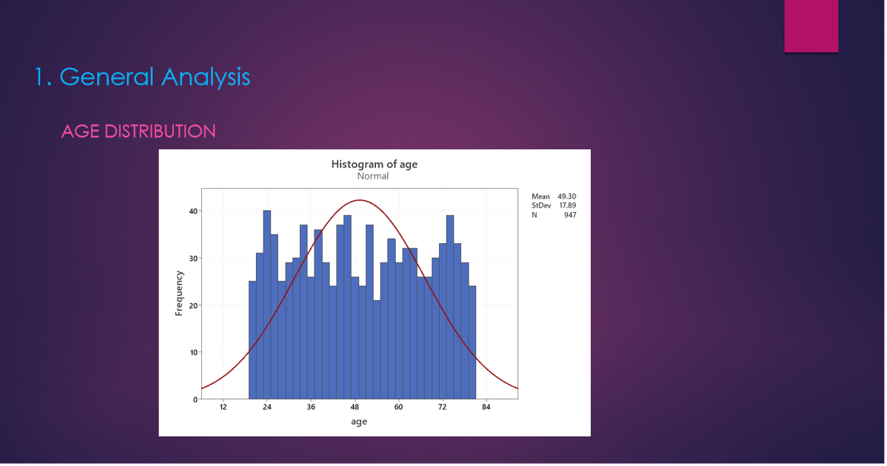
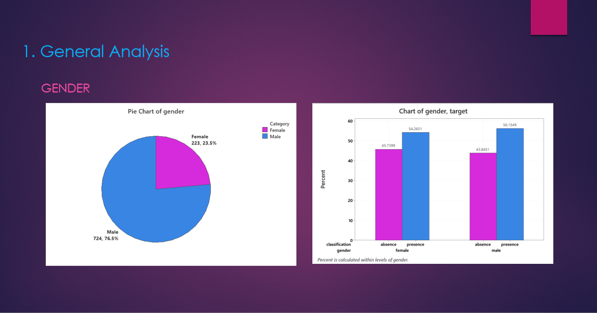
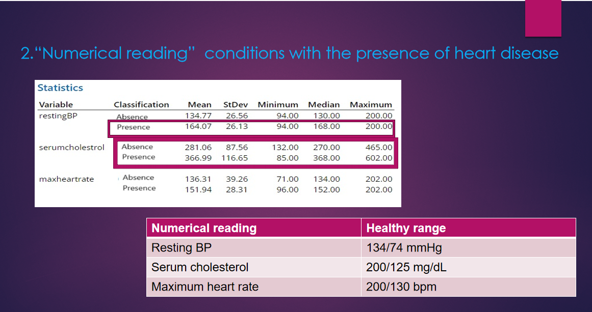
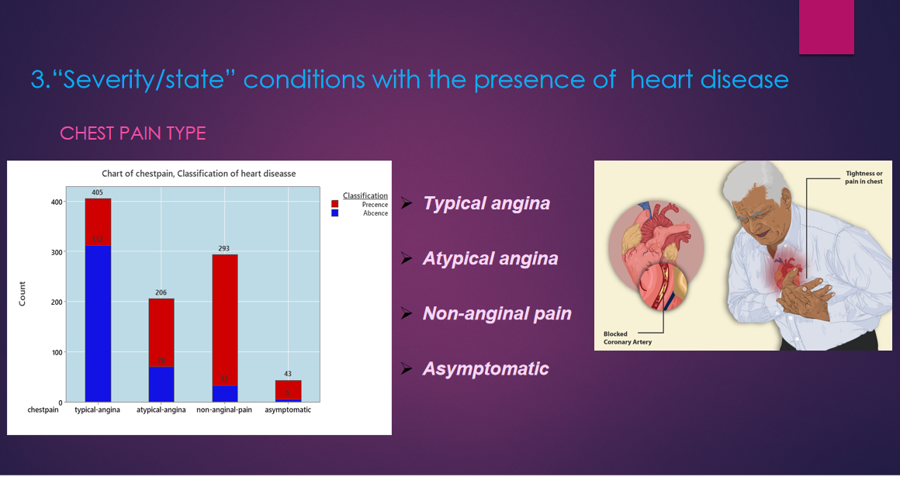
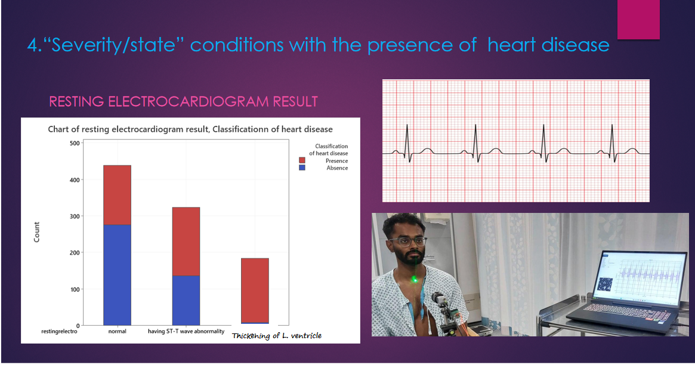
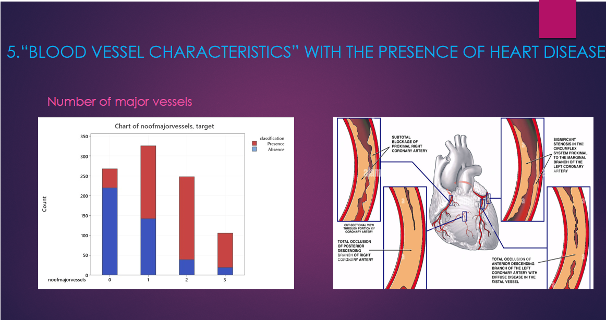
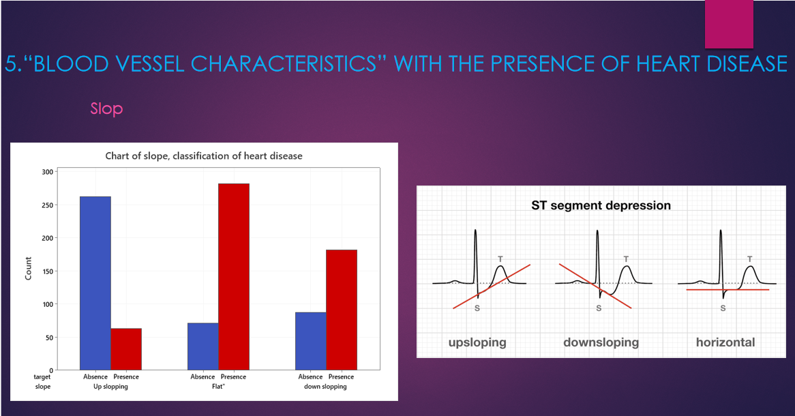

📊 Cardiovascular Disease Analysis using Minitab
📌 Project Overview

This project presents a statistical analysis of a cardiovascular disease dataset to identify key risk factors associated with heart disease. The study was conducted as part of an undergraduate Statistics (ST1009) group project using Minitab.

🖼️ Sample Visualizations

Add your Minitab outputs here:

📊 Age Distribution

❤️ Cholesterol vs Heart Disease

📈 Correlation Heatmap

📉 Regression Output

🎯 Objectives
Analyze cardiovascular patient data using statistical methods
Identify major risk factors for heart disease
Explore relationships between clinical variables
Apply statistical inference techniques
🧪 Methodology

Analysis was performed using Minitab:

Descriptive statistics
Graphical analysis (histograms, boxplots)
Correlation analysis
Regression modeling
Hypothesis testing

🔍 Key Findings
Age increases heart disease risk
Gender differences are significant
Chest pain type is a strong indicator
Blood pressure and cholesterol show strong correlation
ECG and maximum heart rate are important predictors
Vessel blockage is critical for classification

💡 Conclusion

The study shows that statistical tools can effectively identify meaningful health patterns and support early detection of cardiovascular disease.

🛠 Tools Used
Minitab
Microsoft Excel

